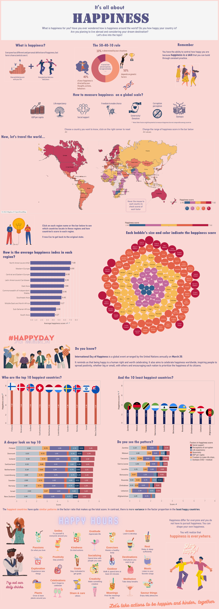

# data_visualization_narration_hslu
A individual project for data visualization and narration class at HSLU.

## Summary of the project:
1. Use case: interactive infographic on a newspaper
2. Target group: Young students from 20 to 20 years old
3. Topic: World Happiness Report
4. Procedure: Making 3 iterations of design: handdrawing, non-interactive & interactive visualiazation
5. Data source: main source https://worldhappiness.report/ & various other sources 

## An overview of my final work for the interactive infographic:

